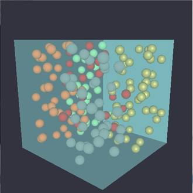

##Collision detection

A project about spherical collision detection. A quadtree can be toggle on/off in order to see the performance difference.
Some keys and their actions are:
* R spawns 5 spheres
* E destroys 5 spheres
* F toggles quadtree
* K look from top of the box to see the quadtree space seperation

