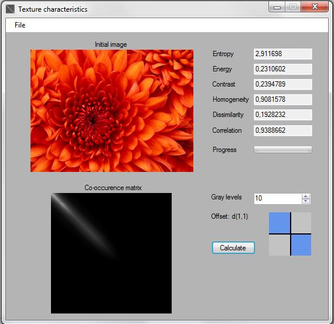

## Texture characteristics extraction with correlation matrices (2014-2015)

This program calculates some characteristics of an image, like entropy, energy ect. The neighborhood, based on which, the correlation matrix will be created, is controlled by the user.

